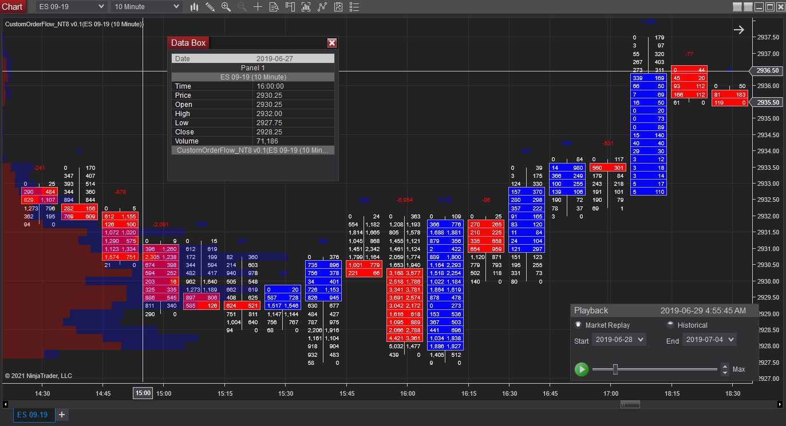

# Trading Toolbox: Technical analysis indicators for NinjaTrader

This repository contains some of the NinjaTrader 7/8 indicators I created around 2019-2021. All were coded in NinjaScript which is a derivative of C#. Indicators function by adding graphical elements (lines, shapes, text) on top of stock charts, allowing traders to monitor possible signals and actively visualize different metrics in real-time.

Sample screenshot of Order Ladder indicator, consisting of a volume ladder overlay on the candlesticks and a volume profile.

## Disclaimer

These scripts were mainly for theory-crafting purposes, as profitable trading strategies often take a long time to thoroughly test and will often become outdated as market conditions change. 

This repository is meant for archiving purposes and I make no claims for the performance and functioning of these indicators. Use at your own risk.

## Installation

To use an indicator, download the corresponding `.cs` file and import into NinjaTrader 8.

## Contents

### Daily High Low

Draws three boxes per trading day, with each box determined by the high and low during its specified time range of the day.

### Order Ladder

Adds a volume profile to the side of the chart, indicating the trading level at each price level. Replaces the bars with a ladder tabulating the number of buys/sells at each price level.

### Two Markets

Draw a channel on the chart based on the prices of bars which corresponds to important times during the Tokyo trading day.

### Three Candles in a Row

A simple indicator. Annotates the chart with arrows whenever three successive candles are up or down.

### Percentage Difference

Shows a databox generated from the low and high of the trading day (day is determined by last visible bar) and a user-specified ratio, which is multiplied against the gap between the low and the high.